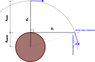

# GNSS geometry

These are simple exercises aimed at getting a feeling on what are the numbers
associated to the GNSS geometry.

Consider this diagram showing a basic (2D) GNSS geometry

Assume the following kown data:

- $h_{GNSS} = h_{GPS} = 20.200\ km$
- $R_{Earth} = 6.371\ km$

## 1. Distance (range):

Compute the following:

1. The distance between the receiver and the satellite at high elevation (i.e. overhead), $R_h$?
2. The travel time for the signal received overhead ($\tau_h$)?
3. The distance between the receiver when the satellite is at low elevation (i.e. horizon), $R_l$?
4. The travel time for the signal received at low elevation ($\tau_l$)

## 2. $\color{blue}{velocity}$ ($\color{blue}{Doppler}$)...

1. What is the meaning of *along-range* and *across-range*?
2. Considering that the Doppler is relative to the range direction, which of these components should be taken to compute velocity or Doppler?
3. What is the Doppler shift for overhead (high elevation) observations?
4. Compute the $\alpha$ angle.
5. What is the orbital speed of GPS satellites? (you may need to look the slides)
6. At the low elevation position, is the satellite approaching or going away? Will the Doppler shift be positive (higher frequency?) or negative (lower frequency)? What is the Doppler shift value for low elevation observations? Remember that:
$$|\Delta f| = \frac{v_{LOS}}{c}\cdot f_0\quad with \quad f_0=1.575,42\ MHz$$

## 3. clock offset in the range:

1. What is the range error if we have a $1\ \mu s$ clock offset?

***

## Answers

1. $Distance$
   1. $$20.200\ km$$
   2. $$\frac{20.200\ km}{3 \cdot 10^5\ km/s} \simeq 0,067\ s$$
   3. $$R_l = \sqrt{(20.200+6371)^2-6371^2} \simeq 25795\ km$$
   4. $$\tau_l = R_l / c \simeq 0,086\ s$$
2. $Doppler$ exercises
   1. *along-range* refers to the component in the direction of the range, *across-range* is the perpendicular
   2. *along-range*
   3. $0\ Hz$
   4. $$\alpha = \arcsin{\left( \frac{6.371}{20.200+6.371}\right )} \simeq 13,9^\circ$$
   5. $$14.000\ km/h \simeq 3,9\ km/s$$
   6. $$v_{along} = 3,9\ km/s \cdot \sin{13,9^\circ} \simeq 0,94\ km/s$$
   $$-0,94/300.000\cdot 1.575.420 \simeq -4,9\ kHz$$

3. $Clock\ offset$ exercises
   1. $$1\ \mu \cdot 3\cdot 10^8\ m/s = 300\ m$$